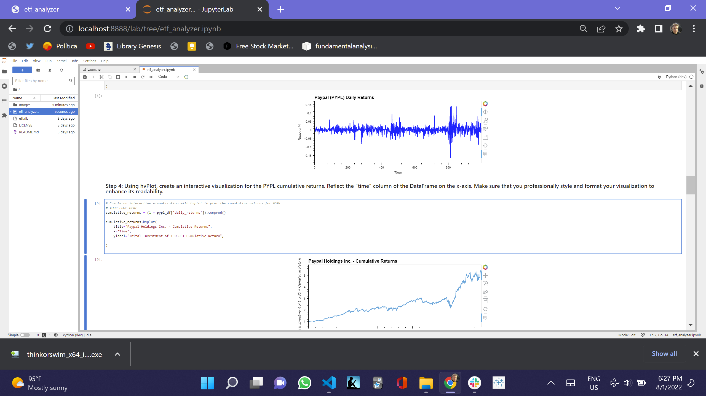
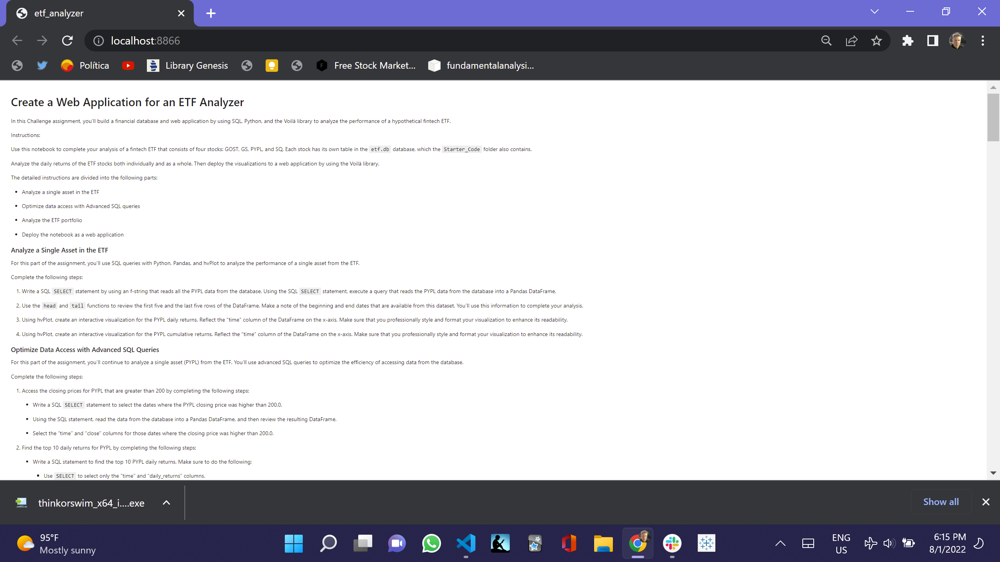
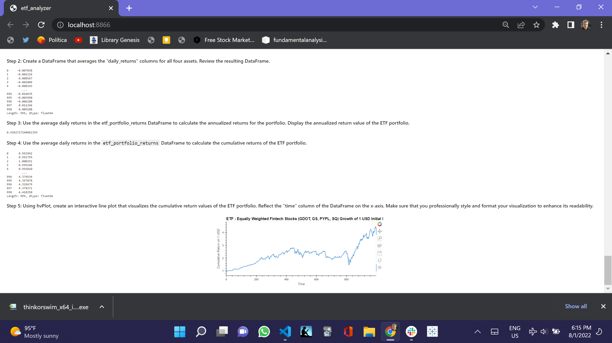
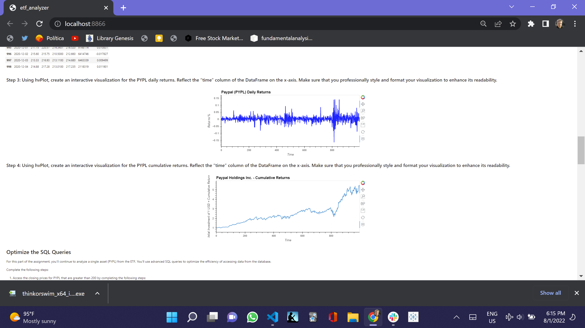

# Module_7_Challenge

# Web Application for an ETF Anaylyzer with SQL, Python and the Voilà library to analyze the performance of a hypothetical fintech ETF.

In this Challenge assignment, I’ll build a financial database and web application by using SQL, Python, and the Voilà library to analyze the performance of a hypothetical fintech ETF.

I wiil complete the analysis of a fintech ETF that consists of four stocks: GOST, GS, PYPL, and SQ. Each stock has its own table in the `etf.db` database.

I will analyze the daily returns of the ETF stocks both individually and as a whole. Then deploy the visualizations to a web application by using the Voilà library.

The detailed instructions are divided into the following parts:

- Analyze a single asset in the ETF

- Optimize data access with Advanced SQL queries

- Analyze the ETF portfolio

- Deploy the notebook as a web application

#### Analyze a Single Asset in the ETF

I'll use SQL queries with Python, Pandas, and hvPlot to analyze the performance of a single asset from the ETF and I will visualize them with an hvplot, for the PYPL daily returns. I will then use the hvPlot, create an interactive visualization for the PYPL cumulative returns.

#### Optimize Data Access with Advanced SQL Queries

Secondly, I will continue to analyze a single asset (PYPL) from the ETF. I will use the following advanced SQL queries to optimize the efficiency of accessing data from the database.

I will find the top 10 daily returns for PYPL, using the order and limit conditions.

Using the SQL statement, I will read the data from the database into a Pandas DataFrame, and then review the resulting DataFrame.

#### Analyze the ETF Portfolio

Then, I will build the entire ETF portfolio and then evaluate its performance. To do so, you’ll build the ETF portfolio by using SQL joins to combine all the data for each asset.

I will write a SQL query to join each table in the portfolio into a single DataFrame.

I will create a DataFrame that averages the “daily_returns” columns for all four assets. Review the resulting DataFrame.

I will use the average daily returns in the `etf_portfolio_returns` dataFrame to calculate the annualized returns for the portfolio. I will display the annualized return value of the ETF portfolio.

I will Uuse the average daily returns in the `etf_portfolio_returns` dataFrame to calculate the cumulative returns of the ETF portfolio.

I will use the hvPlot, create an interactive line plot that visualizes the cumulative return values of the ETF portfolio.

#### Deploy the Notebook as a Web Application

I will use the Voilà library to deploy my notebook as a web application.

Below you will find a screenshot to show how the web application appears when using Voilà.

## Technologies

This was developed with Python, SQL, and the Holoviews and the Voilà library, and Jupyter_Lab and I created it in an Anaconda development environment running Python 3.7.13.

---

## Installation Guide

To install the programs to run the program, you have to do the following.

Install Anaconda and Python. </br>

Git clone the repo and run it, pursuant to the following clone address

git clone https://github.com/JeffSmith-ok/Module_7_Challenge

cd Module_7_Challenge

In the terminal type 'Jupyter Lab'

---

## Usage

The following images show the notebook read in Juypter Lab and in Voila under etf_analyzer.ipynb.

1 shot of the notebook running in Jupyter Lab

##  </br>

3 shots of the notebook running in Voilà

##  </br>

##  </br>

##  </br>

---

## Contributors

This is the seventh of the individual learning challenges.

My contact information is:

Name: Jeffrey M. Smith </br>
Linkedin: https://www.linkedin.com/in/jeffsmith77/ </br>
Personal email: jmstranslate@gmail.com </br>
Phone: 332 238 5209

---

## License

MIT License

Copyright (c) 2022 Jeffrey M. Smith

Permission is hereby granted, free of charge, to any person obtaining a copy of this software and associated documentation files (the "Software"), to deal in the Software without restriction, including without limitation the rights to use, copy, modify, merge, publish, distribute, sublicense, and/or sell
copies of the Software, and to permit persons to whom the Software is furnished to do so, subject to the following conditions:

The above copyright notice and this permission notice shall be included in all copies or substantial portions of the Software.

THE SOFTWARE IS PROVIDED "AS IS", WITHOUT WARRANTY OF ANY KIND, EXPRESS OR IMPLIED, INCLUDING BUT NOT LIMITED TO THE WARRANTIES OF MERCHANTABILITY, FITNESS FOR A PARTICULAR PURPOSE AND NONINFRINGEMENT. IN NO EVENT SHALL THE AUTHORS OR COPYRIGHT HOLDERS BE LIABLE FOR ANY CLAIM, DAMAGES OR OTHER LIABILITY, WHETHER IN AN ACTION OF CONTRACT, TORT OR OTHERWISE, ARISING FROM, OUT OF OR IN CONNECTION WITH THE SOFTWARE OR THE USE OR OTHER DEALINGS IN THE
SOFTWARE.

```

```
